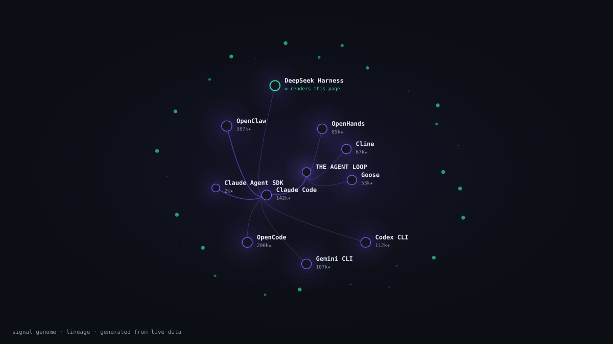

# Signal Genome

Your radar for what's changing in AI tooling. Bright Data scrapes the web, a self-healing agent loop keeps the scrapers alive when sites change, and the data comes out as two views: a **lineage tree** of the AI-tool ecosystem, and a **personal genome** of concepts worth learning.

Built for **Into the Scrape-Verse** (WeMakeDevs × Bright Data, Aug 2026).

## Why it exists

Most scraping projects are a pipeline that breaks silently and a dashboard of tables. We wanted two things instead:

- scrapers that **repair themselves** — sites change layout all the time, so collectors shouldn't just die
- data that reads like a **story**, not a spreadsheet

## How we use Bright Data

Every content source gets its own Scraper Studio collector. We describe what to extract in plain English and get structured JSON back. Each source goes through a 5-agent loop:

1. **planner** — decides which sources are due
2. **builder** — registers a collector on Scraper Studio (`bdata scraper create`)
3. **runner** — executes it (`bdata scraper run`)
4. **validator** — checks the output against the expected schema
5. **healer** — describes the break back to Scraper Studio and re-runs the *same* collector

The loop is the point. When a site changes, validation fails, the healer explains the new structure, and the collector heals in place — same collector id, no manual fixes.

```bash
pnpm harness             # live Bright Data flow (uses credits)
pnpm harness --offline   # same loop against bundled snapshots (no credits)
pnpm health              # per-source status board
```

## What we scrape

**Document sources** (Bright Data Scraper Studio): vLLM docs (sitemap), Unsloth blog, Modal blog, Anyscale blog (discovery). Each item: title, url, author, publish date, body, tags. Public pages only.

**Ecosystem data** (GitHub public API, no key needed): the top ~66 repos across five AI-topic searches — stars, growth velocity, topics — merged with a curated, source-verified lineage of the harness-engineering story.

## How we visualize it

The default view is **LINEAGE**, a radial evolution tree:

- the root is the idea — "the agent loop" — and everything branches from it
- branch width = how many descendants that node spawned
- node size = GitHub stars; pulse = live activity
- scrolling runs an 8-chapter story; the camera flies to each node
- hover = profile; click = **drift diff** against its ancestor
- a time scrubber un-grows the tree back to 2024
- scraped repos orbit outside as "field pulse" — top movers by star velocity

The second view is **GENOME**: the original personal helix of 14 concepts, scored by fitness and momentum, with reactions and a "learn this next" card that explains itself.

## How we represent the data

- Typed end-to-end, with zod at every boundary.
- Drift is expressed in readable capability axes (loop, gateway, plugins, …), not raw logs.
- Facts carry confidence chips (verified / approx) — a pretty tree of made-up facts would be worse than a plain chart.
- The same layout math drives a static SVG snapshot, so the tree is embeddable anywhere.

## The pipeline

```
Bright Data Scraper Studio (c_* collectors)
  → 5-agent harness (create → run → validate → heal)
  → POST /api/internal/ingest (zod normalizers)
  → SQLite
  → gene tagger + fitness + ranker
  → REST /api/genome + SSE /api/events
  → LINEAGE tree + GENOME helix

GitHub API + curated lineage facts
  → data/ecosystem.json → GET /api/ecosystem → LINEAGE
```

## What's unique here

- **The heal loop is the product.** A broken scraper is the demo, not an incident.
- **The tree is a real story.** We verified an actual rename chain — Warelay → Clawdis → Clawdbot → Moltbot → OpenClaw, five names in ten weeks — and it lives in the tree as a branch you can click into.
- **Honest data.** Confidence flags, `(approx)` markers where facts are soft, and the offline path disclosed instead of hidden.
- **An educational payoff.** The genome view says *what to learn next and why* — not just what changed today.

## Run it

```bash
pnpm install
pnpm seed                # historical genome data (54 items)
pnpm dev                 # open http://localhost:5173
pnpm trends              # refresh ecosystem data from GitHub
pnpm harness             # live Bright Data scraping loop
```

## Screenshots

The lineage tree, generated from the live dataset (`pnpm snapshot`):



## Project layout

```
packages/core          content model, schemas, palette
packages/genes         14 genes + weighted tagger
packages/engine        normalizers, fitness, ranker, view model
packages/ecosystem     GitHub trend fetch, lineage facts, tree layout, SVG snapshot
packages/seed-content  historical seed data
apps/collector         bdata wrappers + the 5-agent harness
apps/api               Fastify + SQLite + REST + SSE
apps/web               React: LINEAGE canvas + GENOME helix
docs/                  architecture, demo script, about, pitch
```

Details live in `docs/architecture.md` and `docs/demo-script.md`.